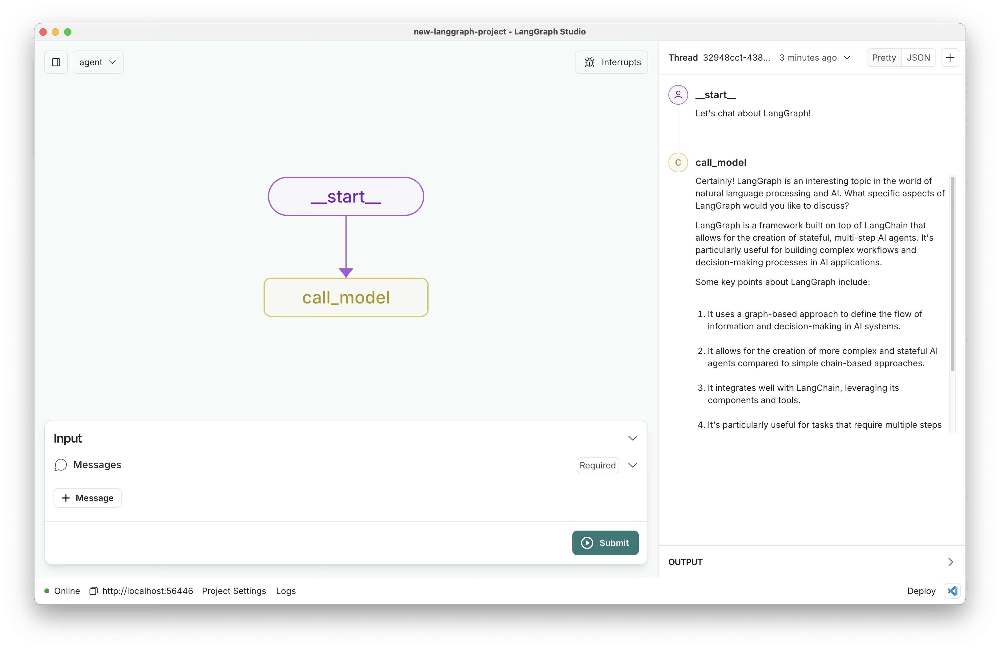

# Inmobilia AI - Asistente Inmobiliario para el Mercado Peruano

Inmobilia AI es un asistente conversacional especializado en bienes raíces para el mercado peruano. Utilizando un sistema multi-agente, el asistente puede recolectar información de usuarios interesados en propiedades, mientras cumple con la Ley 29733 de Protección de Datos Personales.



## Características principales

- 🤖 **Sistema Multi-Agente**: Utiliza agentes especializados para diferentes aspectos de la conversación (legal, recolección de datos, ubicación, preferencias inmobiliarias)
- 🧠 **Orquestación Inteligente**: Coordina la conversación a través de un supervisor que asigna mensajes al agente más adecuado
- 📝 **Gestión de Leads**: Captura y estructura datos de usuarios interesados en propiedades inmobiliarias
- 🔒 **Cumplimiento Legal**: Maneja el consentimiento explícito según la Ley 29733 de Protección de Datos Personales
- 📊 **Analítica Integrada**: Registra métricas y eventos para análisis de conversaciones

## Tecnologías

- [LangGraph](https://github.com/langchain-ai/langgraph): Orquestación y arquitectura multi-agente
- [Anthropic Claude](https://www.anthropic.com/claude): Modelo de lenguaje para procesamiento de texto natural
- [Pydantic](https://docs.pydantic.dev): Validación y serialización de datos
- [LangSmith](https://smith.langchain.com): Monitoreo y trazabilidad (opcional)

## Instalación

1. Clona el repositorio:
   ```bash
   git clone https://github.com/yourusername/inmobilia-ai.git
   cd inmobilia-ai
   ```

2. Crea un entorno virtual:
   ```bash
   python -m venv venv
   source venv/bin/activate  # En Windows: venv\\Scripts\\activate
   ```

3. Instala las dependencias:
   ```bash
   # Instalación con uv (recomendado)
   uv pip install -e .
   uv pip install -e ".[dev]"  # Para desarrollo

   # O con pip tradicional
   pip install -e .
   pip install -e ".[dev]"  # Para desarrollo
   ```

4. Crea un archivo `.env` basado en `.env.example` y añade tu API key de Anthropic:
   ```bash
   cp .env.example .env
   # Edita el archivo .env con tu editor preferido
   ```

## Ejecución

Para iniciar el asistente en modo interactivo:

```bash
python main.py
```

## Comandos Esenciales

```bash
# Ejecutar pruebas
pytest tests/unit_tests/            # Pruebas unitarias
pytest tests/integration_tests/     # Pruebas de integración
pytest tests/standalone/           # Pruebas independientes (sin dependencias)

# Linting y formato
make lint                          # Verificar estilo y tipos
make format                        # Formatear código automáticamente

# Desarrollo
python -m agent                    # Ejecutar agente directamente
```

## Estructura del proyecto

- `/src/agents/`: Agentes especializados (supervisor, legal, collector, location, preferences)
- `/src/models/`: Modelos de datos (LeadData, AgentState) y validadores
- `/src/graphs/`: Grafos de conversación LangGraph
- `/src/services/`: Servicios para persistencia, recomendaciones y analítica
- `/src/config/`: Configuración centralizada
- `/data/`: Datos persistidos (leads, analíticas, propiedades de muestra)
- `/tests/`: Pruebas unitarias y de integración
  - `unit_tests/`: Pruebas unitarias organizadas por componente
  - `integration_tests/`: Pruebas de integración
  - `standalone/`: Pruebas independientes que no requieren dependencias completas

## Configuración del entorno

Variables requeridas en `.env`:
```
ANTHROPIC_API_KEY=sk-...         # API key de Anthropic para Claude
ANTHROPIC_MODEL=claude-3-5-...   # Modelo de Claude a utilizar
DEBUG=True                       # Modo de depuración
LANGSMITH_PROJECT=inmobilia      # Para trazas y monitoreo (opcional)
```

## Arquitectura del Sistema

Este proyecto implementa un asistente inmobiliario conversacional para el mercado peruano usando:
- **LangGraph**: Orquestación de agentes especializados
- **Claude**: Modelo LLM para procesamiento de lenguaje natural
- **Pydantic**: Validación y serialización de datos inmobiliarios

La implementación cumple con la Ley 29733 de Protección de Datos Personales de Perú, especialmente en la obtención y manejo del consentimiento explícito.

## Desarrollado por

Este proyecto fue creado para demostrar las capacidades de LangGraph en la creación de asistentes conversacionales multi-agente para aplicaciones inmobiliarias.